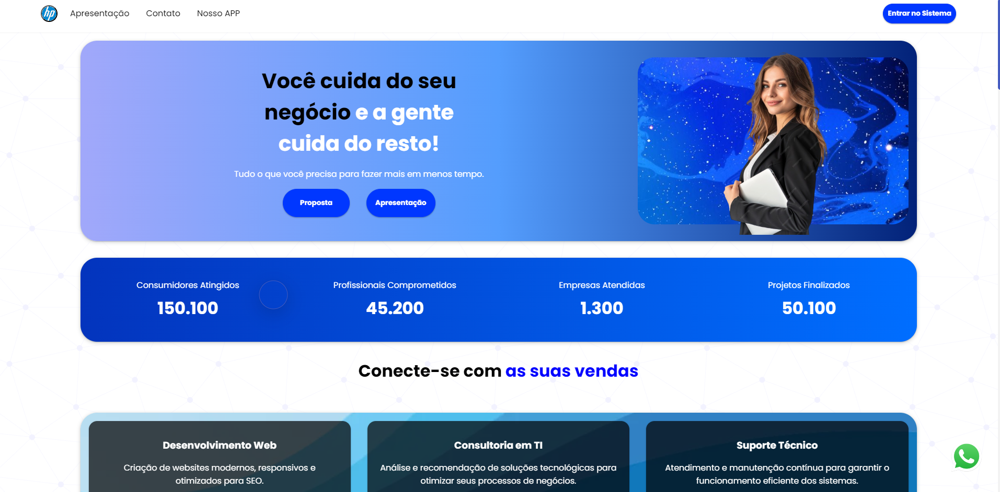
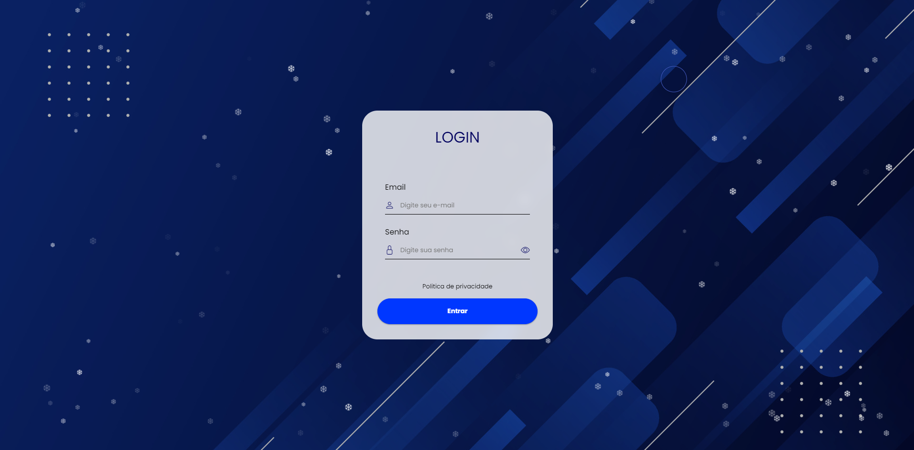

# 🌐 **Landing Page**

Este projeto é uma página web mobile-first e multilíngue projetada para oferecer uma experiência de usuário envolvente e sem interrupções. Ele conta com funcionalidades como modo escuro automático, rolagem suave e uma interface amigável que se adapta a vários dispositivos.

---

## 🚀 **Funcionalidades**

- **Design Mobile-First**: Otimizado para dispositivos móveis para garantir uma experiência responsiva e acessível em todos os tamanhos de tela.
- **Modo Escuro Automático**: Alterna dinamicamente entre os modos claro e escuro com base nas preferências do sistema do usuário.
- **Rolagem Suave**: Proporciona uma experiência de rolagem fluida e visualmente atraente.
- **Suporte Multilíngue**: Oferece conteúdo em três idiomas (Inglês, Português e Espanhol) para atender a um público diversificado.
- **Acesso a Formulário Separado**: Inclui um formulário separado acessível por meio de um botão para entrar no sistema, agilizando as interações do usuário.

---

## 🛠️ **Tecnologias Utilizadas**

- **HTML5**: Estruturação da página e conteúdo.
- **CSS3**: Estilo e responsividade do layout.
- **JavaScript**: Lógica para rolagem suave, tradução de idiomas e interação com o DOM.

---

## 🔧 **Como Executar o Projeto**

<a href="https://vinicius-rodriguess.github.io/Elegant-Landing-Page/" target="_blank">Clique aqui para testar o projeto!</a>





Ou então:

1. **Clone este Repositório**:

   ```bash
   git clone https://github.com/Vinicius-Rodriguess/Elegant-Landing-Page.git
   cd landing-page
   ```

2. **Abra o arquivo** index.html **em seu navegador** para visualizar a Landing Page.

---

## 🖥️ **Exemplo de Uso**

1. **Seleção de Idioma**: Utilize o seletor de idioma para alternar entre Inglês, Português e Espanhol.
2. **Rolagem Suave**: Navegue pela página para experimentar a transição suave entre seções.
3. **Modo Escuro Automático**: O site ajusta automaticamente o tema de acordo com a configuração do sistema.
4. **Formulário de Acesso**: Clique no botão para abrir o formulário separado e interagir com ele.

---

## ✅ **Melhorias Futuras**

- Adicionar animações e transições mais avançadas para melhorar a experiência do usuário.
- Implementar um sistema de login funcional conectado a um back-end.
- Criar mais opções de personalização para usuários avançados.

---

## 👨‍💻 **Autor**

**Vinicius Rodrigues**

- GitHub: [Vinicius-Rodriguess](https://github.com/Vinicius-Rodriguess)
- Email: rodrigues.vini.2004@gmail.com
