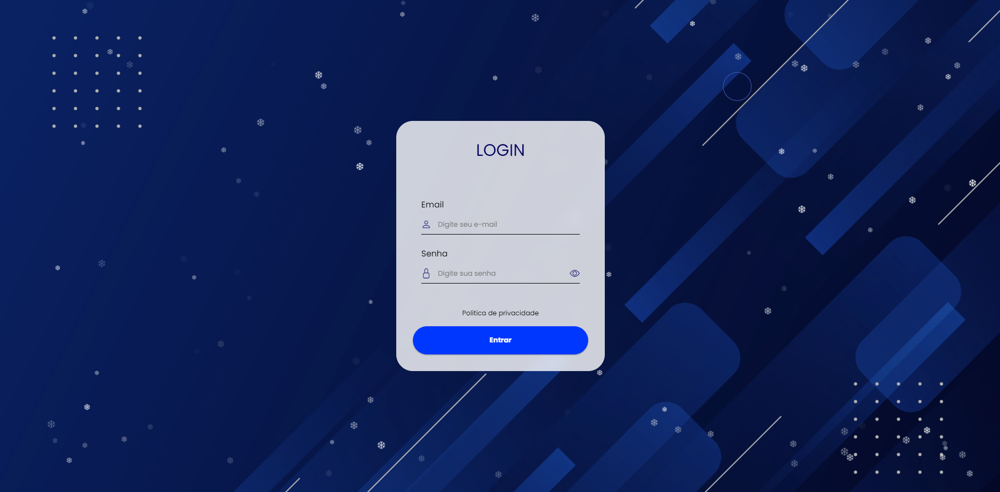

### Projeto de Landing Page

**Visão Geral**  
O projeto Landing Page é uma página web mobile-first e multilíngue projetada para oferecer uma experiência de usuário envolvente e sem interrupções. Ele conta com modo escuro automático, rolagem suave e uma interface amigável que se adapta a vários dispositivos.

**Funcionalidades**
- **Design Mobile-First:** Otimizado para dispositivos móveis para garantir uma experiência responsiva e acessível em todos os tamanhos de tela.
- **Modo Escuro Automático:** Alterna dinamicamente entre os modos claro e escuro com base nas preferências do sistema do usuário.
- **Rolagem Suave:** Proporciona uma experiência de rolagem fluida e visualmente atraente.
- **Suporte Multilíngue:** Oferece conteúdo em três idiomas (Inglês, Português e Espanhol) para atender a um público diversificado.
- **Acesso a Formulário Separado:** Inclui um formulário separado acessível por meio de um botão para entrar no sistema, agilizando as interações do usuário.

<a href="https://vinicius-rodriguess.github.io/Elegant-Landing-Page/" target="_blank">Clique aqui para testar o projeto!</a>

### Landing Page Project

**Overview**
The Landing Page project is a mobile-first, multilingual web page designed to provide an engaging and seamless user experience. It features automatic dark mode, smooth scrolling, and a user-friendly interface that adapts to various devices. 

**Features**
- **Mobile-First Design:** Optimized for mobile devices to ensure a responsive and accessible experience across all screen sizes.
- **Automatic Dark Mode:** Dynamically switches between light and dark modes based on the user's system preferences.
- **Smooth Scrolling:** Provides a fluid and visually appealing scrolling experience.
- **Multilingual Support:** Offers content in three languages (English, Portuguese, and Spanish) to cater to a diverse audience.
- **Separate Form Access:** Includes a separate form accessible by clicking a button to enter the system, streamlining user interactions.

<a href="https://vinicius-rodriguess.github.io/Elegant-Landing-Page/" target="_blank">Click here to test the project!</a>
